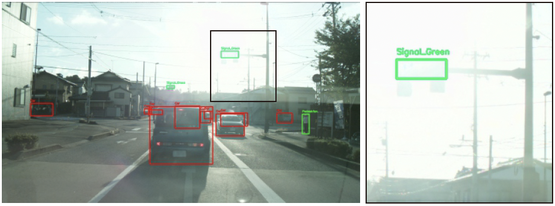
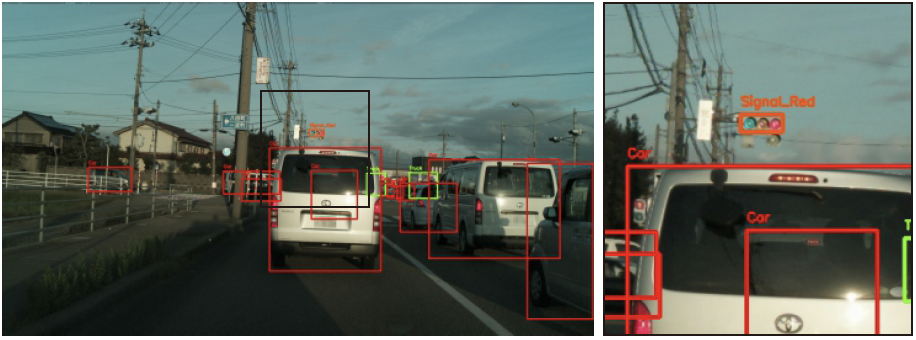

# AD-URBAN Open Image Dataset

## AD-URBAN Project
**AD-URBAN**(FOT project of **A**utomated **D**riving system **U**nder **R**eal city environment **B**ased on **A**cademic Researcher’s **N**eutral knowledge)
プロジェクトは，市街地の高度な自動運転自動車の実現にあたり車載された自律型の高度な認知・判断の技術的な限界点及びそれを支援する道路設備，通信設備などの必要最小限なインフラを議論する研究プロジェクトです．
本プロジェクトは，戦略的イノベーション創造プログラムSIP第2期自動運転（システムとサービスの拡張）の内，自動運転技術（レベル3、4）に必要な認識技術等の研究として2018年度から2022年度までの5年間にわたって金沢大学，中部大学，名城大学の3大学によるオープンな研究体制で実施されています．

## AD-URBAN Open Image Dataset v1.0
自動運転自動車の実用化等が期待される中，重要な研究テーマとして自動運転自動車の認識技術の高度化の研究が望まれています．
これらの研究を加速するためには，さまざまな走行シーンを撮影した膨大な映像を効率的に蓄積し活用するための走行映像データベースの構築が重要です．
金沢大学高度モビリティ研究所では，2021年5月より自動運転自動車に搭載している各種センサで走行データを撮影し、そのデータをもとに走行センサのデータベースの構築技術の確立を目指します．

高度な信号機認識技術の実現に向けた走行映像データの提供について
日本国内の利用者を対象とした研究目的としてのデータ提供を2022年3月後半より開始致します．

### Dataset Overview



自動運転における交差点進入では，一般的に交差点付近の交通参加者や信号機の状態を認識することで交差点可否の可否を判断しています．
信号機の認識に注目するとカメラで撮影された画像から信号機の点灯色を認識することが要求されます．
しかしながら，撮影される画像は太陽光の影響を受けて視認性が変化してしまうため走行時の天候・日照条件に応じて認識が困難な状況が存在します．
そこで本データセットでは，通常，逆光，順光，夜間，雨天など幅広い条件における交差点進入時の走行データを整理して認識が困難となるシーンにおける走行画像をまとめました．
東京臨海部，石川県金沢市周辺での異なる交通環境の走行データを研究目的で提供致します．
ダウンロードリンクは利用規約等の下に記載しています．

### License
Copyright(c) 2022 金沢大学 高度モビリティ研究所

金沢大学 AD-URBAN Open Image Dataset 利用規約（2022年6月23日に改定）
```
金沢大学AD-URBAN Open Image Dataset利用規約（以下「本規約」という．）では，金沢大学高度モビリティ研究所（以下「データセット提供者」という．）から利用者へのデータセットの提供に関し必要となる事項を定める．利用者がデータセットの提供を受ける場合，本規約の条件に同意したものとみなす．
```

（定義）
```
第１条　本規約において，次に掲げる用語は次の定義による．
　(1)「データセット」とは，データセット提供者が利用権限を有し，本規約に基づき，データセット提供者が利用者に提供する走行映像データベースに関するデータセットをいう．データセットには，個人情報の保護に関する法律に定める個人情報は含まないことをデータセット提供者は保証する．
　(2)「利用者」とは，大学，学術研究機関又は企業に属する組織又は個人のうち，データセット提供者がデータセットの利用を許諾した組織又は個人をいう．
　(3)「本目的」とは，研究開発目的をいう．
```

（データセットの提供方法）
```
第２条　データセット提供者は，利用者に対し，データセットのダウンロードリンクを送付する方法により提供する．
```

（データセットの利用）
```
第３条　利用者のみが，データセットを利用することができる．
２　利用者は，データセットを本目的の範囲内でのみ利用することができる．
３　利用者は，本目的以外の目的でデータセットを複製，加工，分析，編集，統合その他を含む利用をしてはならない．
４　利用者は，データセットを第三者に販売，開示，提供，譲渡，利用許諾，漏えいしてはならない。ただし，データセット提供者が利用者に対して明示的に許諾したときは，この限りでない．
５　利用者は，本規約で明示的に規定されているものを除き，データセットについて，内容の訂正，追加又は削除を行ってはならない．
６　データセットに関する知的財産権（データベースの著作物に関する権利を含むが，これに限らない）は，データセット提供者に帰属する．ただし，データセットのうち，第三者に知的財産権が帰属するものはこの限りではない。
```

（利用の停止又は制限）
```
第４条　データセット提供者は，利用者が本規約に違反したときは，当該利用者に対する通知その他一切の手続を要することなく，当該利用者に対し，データセットの全部又は一部の利用を停止若しくは制限し，データセット（複製物を含む．）の破棄を求めることができる．
```

（非保証・免責）
```
第５条　データ提供者は，データセットの正確性，完全性，安全性，有効性及び本目的への適合性その他に関し，明示又は黙示を問わず，一切の保証をしないものとし，利用者は，当該データセットを利用するか否かについて自らの責任で判断するものとする．
２　データセット提供者は，利用者に対し，データセットの利用が第三者の知的財産権，その他の権利を侵害しないことを保証しないものとし，利用者は，当該データセットの権利関係について自らの責任で判断するものとする．
３　利用者は，データセットを利用したことに起因して発生した責任及び損害（第三者の権利の侵害も含む．）について，自らこれを負担し，データセット提供者は一切の責任を負わず，関与しない．
```

（データセットの管理）
```
第６条　利用者は，データセットを他の情報と明確に区別して善良な管理者の注意をもって管理・保管しなければならない．
```

（損害軽減義務）
```
第７条　利用者は，データセットの漏えい，喪失，第三者提供，目的外利用等本規約に違反するデータセットの利用（以下「データセットの漏えい等」という．）を発見した場合，直ちにデータセット提供者にその旨を通知しなければならない．
２　利用者の故意または過失により，データセットの漏えい等が生じた場合，利用者は，自己の費用と責任において，データセットの漏えい等の事実の有無を確認し，データセットの漏えい等の事実が確認できた場合は，その原因を調査し，再発防止策について検討しその内容をデータセット提供者に報告しなければならない．
```

（データセットの利用に基づいて生じた知的財産の取扱い）
```
第８条　データセットの利用者の利用に基づき生じた発明，考案，創作及び営業秘密等に関する知的財産権は，利用者に帰属する．
```

（研究成果の公表）
```
第９条　利用者は，データセットを利用した研究成果を公表する場合，金沢大学AD-URBAN Open Image Datasetを用いた研究成果であることを明示しなければならない．
```

（損害賠償）
```
第１０条　利用者は，本規約に違反した場合その他故意又は過失によってデータセット提供者に損害（合理的な範囲内の弁護士費用を含む．）を与えた場合には，これを賠償する責任を負う．ただし，損害賠償の範囲には，天災地変その他の不可抗力により生じた損害，自己の責に帰すべからざる事由により生じた損害及び逸失利益は含まれないものとする．
```

（非譲渡性）
```
第１１条　利用者は，事前にデータセット提供者の書面による承諾を得ることなく，本規約上の地位及び権利義務の全部若しくは一部を第三者に譲渡し，承継させ，又は担保に供してはならない．
```

（反社会的勢力でないことの表明）
```
第１２条　利用者は，以下の各号に定める事項を表明し，保証する．
　(1)　自らが，暴力団，暴力団員，暴力団準構成員，暴力団員でなくなったときから５年を経過しない者，暴力団関係企業，総会屋，政治活動・宗教活動・社会運動標榜ゴロ，特殊知能暴力集団その他これらに準ずる者（以下，総称して「反社会的勢力」という。）に該当しないこと．
　(2)　反社会的勢力を利用しないこと．
　(3)　自ら又は第三者を利用して，次の行為を行わないこと．
　　　ア　反社会的勢力を名乗るなどして相手方の名誉・信用を毀損し又は相手方の業務を妨害する行為
　　　イ　法的な責任を超えた不当な要求行為
　(4)　取締役，執行役員及び実質的に経営に関与する者が反社会的勢力でないこと及びそれらの者が反社会的勢力と交際がないこと．
　(5)　自らの財務及び事業の方針の決定を支配する者が反社会的勢力でないこと及び反社会的勢力と交際がないこと．
２　利用者は，自らが前項に違反していることを発見した場合，直ちにデータセット提供者にその事実を報告するものとする．
３　データセット提供者は，利用者が第１項に違反した場合，催告その他何らの手続を要することなく，当該利用者に対し，データセットの利用を停止させ，データセット（複製物を含む．）の破棄を求めることができる．
４　前項の規定により利用者に損害が生じたとしても，データセット提供者は，一切の損害賠償義務を負わない．
５　利用者が第１項に違反したことにより損害を被った場合，データセット提供者は，当該損害について損害賠償を当該利用者に請求することができる．
```

（規約の変更）
```
第１３条　データセット提供者は，必要と判断した場合に本規約を改定できるものとする．
２　データセット提供者は，本規約の改定を行った場合には，改定後の本規約を金沢大学高度モビリティ研究所のホームページを通じて利用者に周知し，改定後の本規約は改定時から有効とする．
```

（紛争解決）
```
第１４条　本規約は日本法を準拠法とする．本規約に関する訴えは，金沢地方裁判所の管轄に属する．本規約に関して紛争が生じた場合は，利用者及びデータセット提供者は誠意をもって協議し、問題を解決することに努めるものとする．
```

### Privacy Protection
```
収取しました走行映像データにつきましては，大学および大学が指定する機関において，道路上の歩行者や車両等の個人情報と結びつく情報（歩行者の顔や車両のナンバープレート情報等）は，特定ができないようにフィルタリング処理を行います．
```

### Privacy Policy
本サイトでは，個人情報保護に関する法令を遵守し，個人情報の取扱いを行います．
```
・個人情報の定義について
  - 個人情報とは，個人に関する情報（名前，生年月日，性別，電話番号，電子メールアドレス，職業，勤務先等）で，特定の個人を識別できるものと定義されています．
・本データセットの利用申込みにあたり，以下の目的のため，その範囲内においてのみ，個人情報を収集・利用いたします．本サイトによる個人情報の収集・利用はお問合せを頂いた方（以下「問合せ者」と称す）の自発的な提供によるものであり，問合せ者が個人情報を提供された場合は，本サイトが本方針に則って個人情報を利用することを問合せ者が許諾したものとします．法令に基づく場合等正当な理由によらない限り，事前に本人の同意を得ることなく，個人情報を第三者に開示・提供することはありません．
  - データセットのダウンロードリンクの送付
  - 各種のお問い合わせ対応
・個人情報の管理・取扱い・セキュリティについて
  - 個人情報は，不正アクセス等にて漏えい，紛失，改ざん等を防止・是正および，その他の安全管理のため，必要かつ適切な措置を講じるよう十分な安全保護に努めます．また，お預かりした個人情報の適切な管理を行います．また，個人情報を保護するためのセキュリティ対策を常に行い，定期的かつ継続的に管理していきます．
・個人情報の開示・訂正・削除について
  - 個人情報の開示および訂正，削除は，本人確認を行った上で適正と判断した場合に行います．
```

## Download
本データセットの利用をご希望の方は[こちらの入力フォーム](https://forms.gle/BihehFhn7GwX6GcV9)より必要事項をご連絡ください．後ほど担当者よりデータのダウンロードをリンクを送付させていただきます．
本データセットは日本国内での利用者に限定して提供致します．（2022/3/31）

## Contact
国立大学法人 金沢大学 高度モビリティ研究所
- 住所：〒920-1192 石川県金沢市角間町
- 電話/メール：076-234-4714/secsuganuma@staff.kanazawa-u.ac.jp

## Acknowledgement
本事業は，総合科学技術・イノベーション会議の戦略的イノベーション創造プログラム（SIP）第2期/自動運転（システムとサービスの拡張）「自動運転技術（レベル3, 4）に必要な認識技術等に関する研究」（管理法人: NEDO）によって実施されました．

## Link
- 金沢大学高度モビリティ研究所 [[link](https://admore.w3.kanazawa-u.ac.jp)]
- 金沢大学計測制御研究室 お知らせ [[link](http://its.w3.kanazawa-u.ac.jp/information.html)]
  
